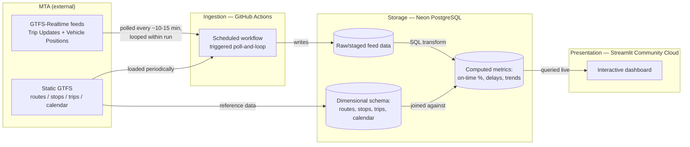

# Architecture Document

## TransitPulse — NYC Subway Reliability Analytics Platform

| Field | Value |
|---|---|
| Document status | **Approved v1.0 — baseline** |
| Last updated | 2026-07-20 |
| Approved | 2026-07-20 |
| Depends on | PRD v1.1 (baseline, revised) |
| Related documents | Research Summary (prior phase) — PRD v1.1 — UX Plan (not yet written) — Implementation Roadmap (see ROADMAP.md) |

**Approval note:** Reviewed and approved, including ADR-001 (ingestion platform selection) and its Future Evolution section. Section 3's conceptual data model is confirmed as the appropriate level of detail for this document; physical schema remains deferred to implementation, per Section 7.

**Purpose of this document:** This document describes *how* the system is built to satisfy the requirements in the PRD. It assumes the PRD is already read and approved, and it references PRD requirement IDs (FR-x, NFR-x) directly rather than restating them. Where a decision involved a real trade-off between competing options, it is recorded as a formal Architecture Decision Record (ADR) so a future maintainer can see not just *what* was chosen but *why*, and what else was considered.

**What this document does not cover:** exact SQL DDL, column-level schema definitions, UI layout/navigation (UX Plan), and step-by-step setup instructions (README). Those are downstream artifacts that will reference this document's component and data-model decisions.

---

## 1. System Overview

TransitPulse is a four-stage pipeline: a scheduled process collects live transit data, stores it durably, transforms it into reliability metrics, and serves those metrics through an interactive dashboard.

This diagram is intentionally kept in the document as Mermaid source (not an exported image) so it stays version-controlled and diffable alongside the rest of the documentation, consistent with the maintainability standard for this project.

---

## 2. Components

### 2.1 Ingestion Service
**Responsibility:** Poll MTA's GTFS-Realtime feeds for the in-scope lines (1/2/3/4/5/6/7, per PRD Section 11), parse the protobuf payloads (including NYCT-specific extension fields), validate structure, and write records to the database. Also responsible for periodically refreshing the static GTFS reference data.

**Satisfies:** FR-1 (revised), FR-2, FR-3, FR-10, NFR-1 (revised), NFR-2, NFR-7.

**Platform:** GitHub Actions scheduled workflow. See ADR-001 for the full rationale.

**Failure handling (FR-10, NFR-1):** Each run logs its outcome (success, partial failure, total failure) to a structured log table in the database, not just to GitHub's own run history — this ensures failure visibility is queryable from within the same system the dashboard already reads from, rather than requiring a maintainer to separately check GitHub's UI.

**Run status contract** (referenced by the dashboard today, and by any future alerting/anomaly logic — this is a cross-component contract, not just a log message, so it's defined here rather than only in code comments):
- `success` — every poll cycle within the run completed without error.
- `partial_failure` — at least one poll cycle within the run failed (e.g., a transient network error), but the run continued and at least attempted subsequent cycles rather than aborting. Some data from this run window may be missing, but the ingestion process itself did not stop running.
- `failure` — the run could not proceed at all (e.g., no database connection could be obtained). No data was written for this run window.

This three-state distinction exists specifically so a `partial_failure` (an isolated, likely-recoverable blip) can be distinguished from a `failure` (the run never got going) when reviewing pipeline health — collapsing them into a single "error" state would make it harder to tell "this run mostly worked" from "this run didn't work at all." The retry/backoff mechanics that produce these states are an implementation detail (see `src/ingestion/run_ingestion.py`); this contract — the three status values and their meaning — is not, and should not change without updating every consumer of `ingestion_run_log`.

### 2.2 Storage Layer
**Responsibility:** Durable persistence of both raw ingested data and derived reference/metric data.

**Satisfies:** FR-2, FR-3, NFR-3, NFR-4.

**Platform:** Neon (serverless PostgreSQL, free tier).

**Design note:** The schema is split conceptually into (a) dimension tables sourced from static GTFS (routes, stops, trips, calendar — relatively stable, refreshed periodically) and (b) fact tables sourced from the real-time feed (positions and trip-update events — high write volume, append-heavy). This dimension/fact separation is a structural decision made here; exact column-level DDL is an implementation-phase artifact, not part of this document.

### 2.3 Transformation / Metrics Layer
**Responsibility:** Compute on-time/delayed classification per trip, and aggregate into line/station/time-window/trend views.

**Satisfies:** FR-4, FR-5, FR-9, FR-12 (should).

**Implementation approach:** SQL views/queries executed against the Neon database — not a separate compute service. This keeps the transformation logic colocated with the data it operates on, avoids introducing a fourth platform, and is the most direct way to demonstrate SQL proficiency, which is a stated project goal.

### 2.4 Presentation Layer
**Responsibility:** Render the dashboard views defined in FR-6 through FR-9.

**Satisfies:** FR-6, FR-7, FR-8, FR-9, NFR-6.

**Platform:** Streamlit Community Cloud, reading directly from Neon.

---

## 3. Conceptual Data Model

This is a logical model — entities and their relationships — not a physical schema. Physical schema (keys, indexes, types) is an implementation-phase decision informed by this model.

**Dimensions** (relatively stable, sourced from static GTFS):
- `route` — a subway line (e.g., the "1" train)
- `stop` — a physical station/platform
- `trip` — a scheduled single run of a vehicle along a route
- `calendar` — service date patterns (weekday/weekend/holiday)

**Facts** (event/time-series data, sourced from the real-time feed):
- `vehicle_position_event` — a snapshot of where a trip's vehicle was at a point in time
- `trip_update_event` — a snapshot of predicted/actual arrival-departure times for a trip's upcoming stops
- `computed_trip_performance` — derived, not raw: the on-time/delayed classification per completed trip, computed from the above

**Operational/meta tables** (not part of the analytical model, but required by NFR-1/FR-10):
- `ingestion_run_log` — one row per ingestion workflow run, recording outcome and any errors

This structure directly supports FR-5 (aggregation by line/station/time-window) because `computed_trip_performance` rows can be joined against the `route`, `stop`, and `calendar` dimensions without redesign — the "Should"-priority FR-13 (expandability to more lines without schema change) is satisfied by this model as long as new lines are inserted as new `route` dimension rows, not new tables.

---

## 4. Deployment Architecture

| Concern | Decision | Rationale |
|---|---|---|
| Ingestion compute | GitHub Actions (public repo, scheduled workflow) | See ADR-001 |
| Database hosting | Neon free tier | Free, serverless (auto-wakes on connection), sufficient capacity for the in-scope line subset over the 4-6 week collection window |
| Dashboard hosting | Streamlit Community Cloud | Free for public repos; acceptable that it sleeps between visits (NFR-6 concerns query responsiveness once loaded, not standby state) |
| Secrets management | GitHub Actions repository secrets (DB connection string for ingestion); Streamlit Community Cloud's secrets manager (DB connection string for the dashboard) | Neither the connection string nor credentials are ever committed to the repository — satisfies basic security hygiene without adding a dedicated secrets-management platform, which would be disproportionate to this project's scale |
| Environment reproducibility | All three platforms are configured declaratively from files committed to the repo (workflow YAML, `requirements.txt`/dependency file, Streamlit app config) | Satisfies NFR-4 — a new contributor can reconstruct the entire deployed system from the repository plus free-tier account creation, with no undocumented manual steps |

---

## 5. Architecture Decision Records

### ADR-001: Ingestion Compute Platform

**Status:** Accepted

**Context:**
FR-1 (as originally written) and NFR-1 require durable, continuous ingestion of a live feed with automatic recovery from failure, at $0 cost (NFR-3), on infrastructure a future maintainer could reasonably take over (NFR-4, NFR-5). At the time of this decision, the free-tier hosting landscape does not offer a straightforward always-on, zero-maintenance option: Railway and Fly.io no longer offer free tiers, and Render's free web-service tier sleeps after inactivity, which is incompatible with a persistent polling process.

**Options considered:**

| Option | Cost | Operational complexity | Reliability | Satisfies original FR-1/NFR-1 literally? | Maintainability |
|---|---|---|---|---|---|
| GitHub Actions scheduled workflow | $0 (unlimited minutes, public repo) | Low | Medium — scheduling isn't guaranteed to the minute; scheduled workflows auto-disable after 60 days of repo inactivity | No | High — fully declarative, reproducible from the repo alone |
| Oracle Cloud "Always Free" Ampere VM | $0 ongoing (card required at signup) | High — full VM administration (patching, process supervision, networking) | Nominally highest (true always-on), but real-world reports show inconsistent idle-reclaim behavior and regional capacity constraints | **Yes** | Medium-low — configuration lives outside the repo unless additional Infrastructure-as-Code investment is made |
| Self-hosted (developer's own always-on machine) | $0 (existing hardware) | Low technically, but depends on continuous uptime of personal infrastructure | Lowest — no redundancy, dependent on home power/network | Yes, while the machine is running | Low — not reproducible by a future maintainer at all; rejected outright on this basis |

**Decision:**
GitHub Actions was selected. It does not satisfy the literal original wording of FR-1/NFR-1 (continuous ~30-second polling with platform-guaranteed reliability), and this is treated as an explicit, documented trade-off rather than an implementation detail absorbed silently. FR-1 and NFR-1 in the PRD have been revised accordingly, with this ADR as the referenced rationale.

**Why this trade-off was accepted:** The project's primary objective (per PRD Section 1 and Section 3) is to demonstrate data engineering, SQL, pipeline design, and analytics — not cloud infrastructure administration. Oracle's VM option would satisfy the literal requirement but at the cost of shifting real project effort toward VM operations, and it introduces a maintainability gap (bespoke server config outside the repo) that conflicts with this project's explicit "next engineer" documentation standard. Self-hosting was rejected outright on the same maintainability basis, independent of any other factor.

**Consequences:**
- Ingestion will occur via short, triggered, looped polling runs (approximately every 10-15 minutes, polling repeatedly within each run) rather than a single persistent process. This is expected to produce near-continuous but not gapless coverage.
- The `ingestion_run_log` table (Section 3) becomes the mechanism for detecting and documenting any gaps honestly, rather than presenting the historical dataset as if it had no collection interruptions.
- A mitigation is required for GitHub's 60-day scheduled-workflow auto-disable-on-inactivity behavior. During the active build/collection window, ongoing development commits will keep the repository active; if the collection window is ever paused for longer than 60 days with no other repo activity, the workflow will need to be manually re-enabled. This is documented here so it isn't rediscovered as a surprise.

**Future Evolution:**
If a future requirement demands true near-real-time continuous ingestion (e.g., sub-minute latency guarantees) or higher platform-level reliability than GitHub Actions can offer, the ingestion service can be migrated to an always-on compute platform (such as the Oracle Cloud option evaluated above, or a paid always-on host) **without requiring a redesign of the rest of the system.** This is possible because the ingestion service's only contract with the rest of the architecture is "write valid records into the Storage Layer's fact tables" (Section 2.1, Section 3) — the database schema, transformation layer, and dashboard have no dependency on *how* or *from where* those writes happen. Migrating the ingestion compute platform would be a contained, isolated change, not a cross-cutting one.

---

## 6. Non-Functional Requirement Traceability

| NFR | How this architecture satisfies it |
|---|---|
| NFR-1 (revised) | ADR-001; `ingestion_run_log` table; GitHub Actions' built-in run-history and retry-on-next-schedule behavior |
| NFR-2 | Ingestion Service validates payload structure before writing; malformed records are logged and rejected, not stored (Section 2.1) |
| NFR-3 | All three platforms (GitHub Actions, Neon, Streamlit Community Cloud) confirmed free-tier as of this document's writing (Section 4) |
| NFR-4 | Fully declarative, repo-defined configuration across all components (Section 4) |
| NFR-5 | Dimension/fact separation (Section 3) and component responsibility boundaries (Section 2) are documented explicitly for a future maintainer |
| NFR-6 | Transformation layer (Section 2.3) precomputes aggregates in SQL rather than requiring the dashboard to aggregate raw event-level data at query time |
| NFR-7 | Ingestion respects MTA's usage terms (self-hosted storage, no direct proxying) as confirmed in the Research phase; polling frequency is well within any reasonable-use expectation |
| NFR-8 | `ingestion_run_log` provides a queryable health signal without manual raw-data inspection |

---

## 7. Open Items Deferred to Later Phases

| Item | Deferred to |
|---|---|
| Exact physical schema (DDL, keys, indexes, types) | Implementation phase |
| Retention/aggregation strategy to bound database growth (Risk R-6 in PRD) | Implementation phase, informed by observed data volume in week 1 |
| Anomaly-detection method for FR-12 | Implementation phase (this document only confirms the transformation layer can support it structurally) |
| Dashboard layout, navigation, and visual design | UX Plan (next phase) |
| Setup/runbook instructions | README (Documentation phase) |
